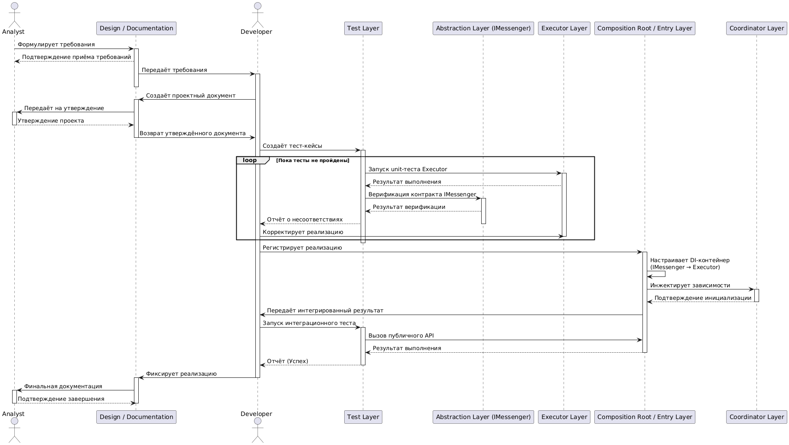

# 4_b. Sequence Diagram: Создание и тестирование нового Sender

## Визуализация

Схема процесса создания и тестирования нового Sender доступна в виде диаграммы:

- [PlantUML код диаграммы](diagrams/sequence_creation_diagram.md)
- 

## Цель
Отразить динамический процесс разработки нового Sender с использованием TDD и DI через Composition Root.  
Диаграмма демонстрирует взаимодействие всех слоёв системы, ролей участников и документооборот.

---

## Участники и их ответственность

| Участник | Роль | Основная ответственность |
|----------|------|-------------------------|
| **Analyst** | actor | Формулирует требования, утверждает проектные и фиксирующие документы, контролирует соответствие реализации бизнес-требованиям. |
| **Developer** | actor | Реализует функциональность нового Sender, управляет DI через Composition Root, фиксирует результаты в документации, корректирует реализацию по результатам TDD. |
| **Test Layer** | participant | Проверяет Executor и контракт через Abstraction (`IMessenger`), инициирует цикл TDD до прохождения тестов, выполняет интеграционный тест через Composition Root. |
| **Design / Documentation Layer** | participant | Хранит требования, проектные и фиксирующие документы; обеспечивает валидацию реализации и передачу итоговой документации аналитикам. |
| **Abstraction Layer (`IMessenger`)** | participant | Контракт между Coordinator и Executor, обеспечивает изоляцию реализации от координатора. |
| **Executor Layer** | participant | Реализует функциональность нового Sender, взаимодействует с тестами и абстракцией. |
| **Coordinator Layer** | participant | Интегрирует Executor через контракт, получает реализацию через DI. |
| **Composition Root / Entry Layer** | participant | Связывает слои и управляет DI; передаёт интегрированную реализацию Coordinator и разработчику; участвует в интеграционном тесте. |

---

## Порядок шагов

### 1. Формирование требований
1. Analyst формулирует документ требований ("Функциональные и нефункциональные требования").  
2. Documentation Layer фиксирует документ и подтверждает получение.  
3. Documentation Layer передаёт требования Developer.

### 2. Проектирование Sender
4. Developer создаёт проектный документ "Проектирование нового Sender".  
5. Documentation Layer передаёт документ на утверждение Analyst.  
6. Analyst утверждает проект.  
7. Documentation Layer возвращает утверждённый проект Developer.

### 3. Подготовка тестов
8. Developer создаёт документ тестов "Тест нового Sender".  
9. Test Layer получает документ и подтверждает готовность.

### 4. TDD-цикл
10. Test Layer запускает unit-тест Executor.  
11. Executor выполняет тест и возвращает результат.  
12. Test Layer проверяет контракт IMessenger через Abstraction Layer.  
13. Abstraction Layer возвращает результат верификации Test Layer.  
14. Test Layer отправляет отчёт о несоответствиях Developer.  
15. Developer корректирует реализацию Executor.  
16. Цикл повторяется, пока тесты не пройдут успешно.

### 5. Связывание через DI
17. Developer регистрирует реализацию в Composition Root.  
18. Composition Root настраивает DI-контейнер (IMessenger → Executor).  
19. Composition Root инжектирует зависимости в Coordinator Layer.

### 6. Валидация и фиксация
20. Composition Root передаёт интегрированный результат Developer.  
21. Developer запускает интеграционный тест через Test Layer.  
22. Test Layer вызывает публичный API Composition Root и получает результат.  
23. Test Layer возвращает отчёт Developer о прохождении интеграционного теста.  
24. Developer фиксирует реализацию в Documentation Layer.  
25. Documentation Layer передаёт финальный документ Analyst для подтверждения завершения проекта.

---

## Примечания
- Цикл TDD гарантирует соответствие реализации требованиям до интеграции.  
- Composition Root демонстрирует принцип инверсии зависимостей и управляет связями между слоями.  
- Documentation Layer является источником истины для требований и результатов разработки.  
- Sequence Diagram визуально соответствует указанному порядку шагов и ролям участников.
