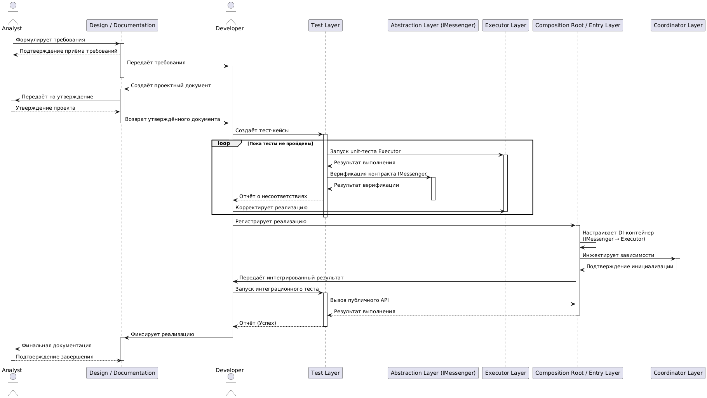

@startuml
' Участники
actor Analyst as anl
participant "Design / Documentation" as des

actor Developer as dev
participant "Test Layer" as test
participant "Abstraction Layer (IMessenger)" as abs
participant "Executor Layer" as exe
participant "Composition Root / Entry Layer" as com
participant "Coordinator Layer" as coo

' --- Процесс ---

' 1. Формирование требований
anl -> des : Формулирует требования
activate des
des --> anl : Подтверждение приёма требований
des -> dev : Передаёт требования
activate dev
deactivate des

' 2. Проектирование Sender
dev -> des : Создаёт проектный документ
activate des
des -> anl : Передаёт на утверждение
activate anl
anl --> des : Утверждение проекта
deactivate anl
des -> dev : Возврат утверждённого документа
deactivate des

' 3. Подготовка тестов
dev -> test : Создаёт тест-кейсы
activate test

' 4. TDD-цикл
loop Пока тесты не пройдены
    test -> exe : Запуск unit-теста Executor
    activate exe
    exe --> test : Результат выполнения
    test -> abs : Верификация контракта IMessenger
    activate abs
    abs --> test : Результат верификации
    test --> dev : Отчёт о несоответствиях
    deactivate abs
    dev -> exe : Корректирует реализацию
    deactivate exe
end
deactivate test

' 5. Связывание через DI
dev -> com : Регистрирует реализацию
activate com
com -> com : Настраивает DI-контейнер\n(IMessenger → Executor)
com -> coo : Инжектирует зависимости
activate coo
coo --> com : Подтверждение инициализации
deactivate coo

' 6. Валидация и фиксация
com -> dev : Передаёт интегрированный результат
dev -> test : Запуск интеграционного теста
activate test
test -> com : Вызов публичного API
com --> test : Результат выполнения
deactivate com
test --> dev : Отчёт (Успех)
deactivate test

dev -> des : Фиксирует реализацию
deactivate dev

activate des
des -> anl : Финальная документация
activate anl
anl --> des : Подтверждение завершения
deactivate anl
deactivate des
@enduml